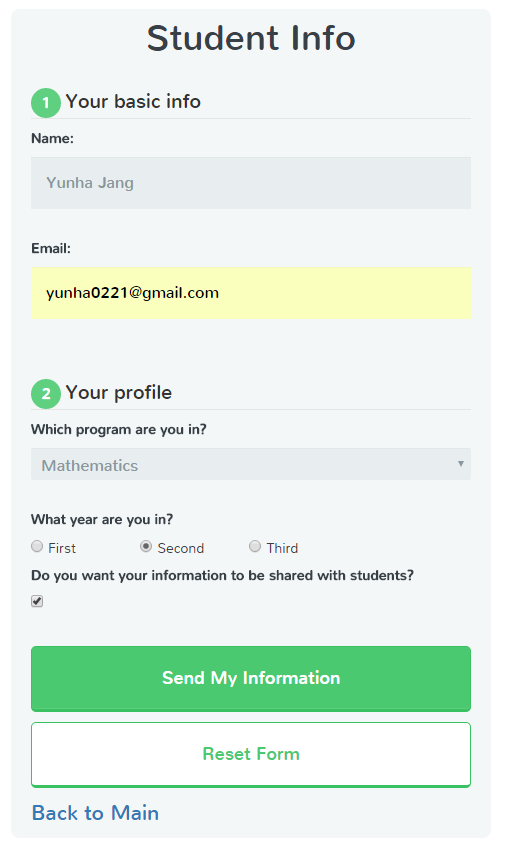
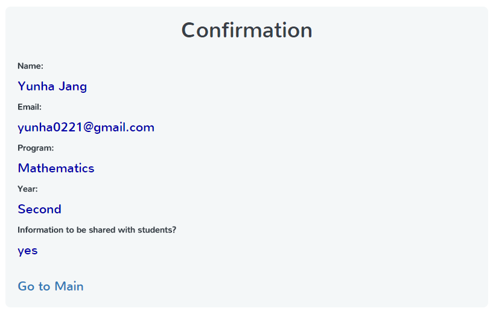
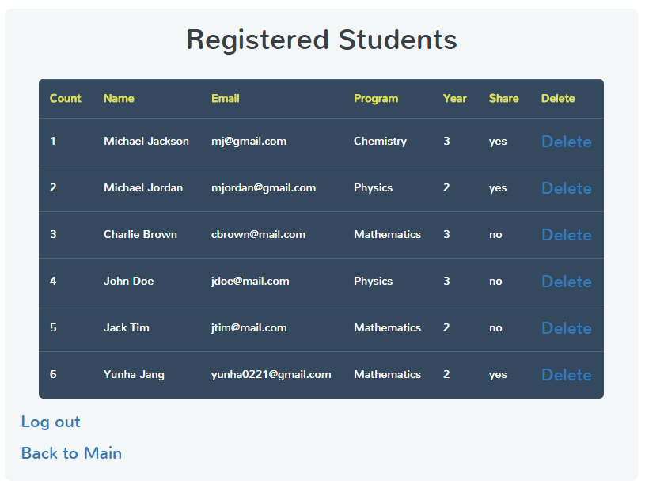

# Student Registration System

This is my project of the Enterprise JAVA course in semester 3.
It is a JAVA web app using the Servlet and MySQL.
The Student Registration System shows students list and user can add or delete students based on the roles (student and teacher) by configuration in the web.xml.

-	Student or teacher can register

-	Student can see only shared students list

-	Teacher can see all students list

-	Teacher can delete students

I used DataSourceRealm for login validation
